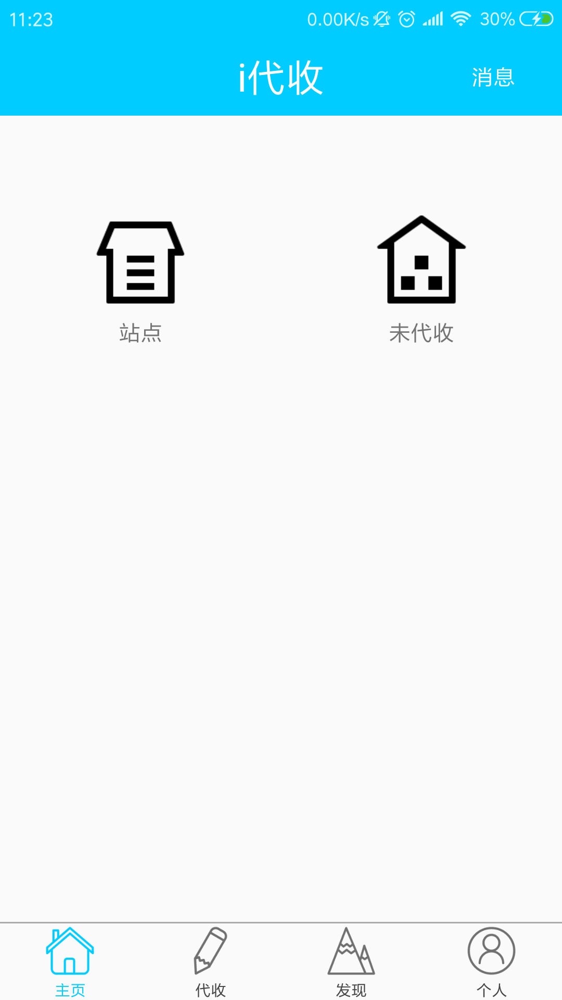
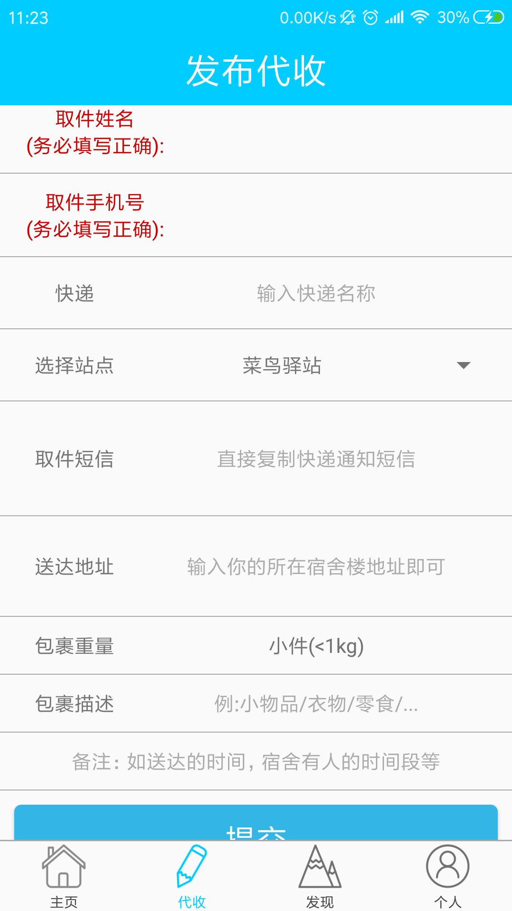
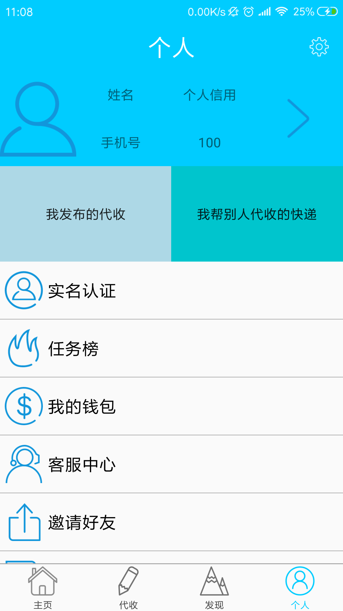

# express-agent-android

  # "i 代收"是一款解决校园快递信息管理和取件难题的应用软件。创新快递分发流程、实现快递信息精准推送、人人众包送货上门。

   ## App 主界面分为"主页","代收","发现","个人"
   ### 在主页中我们可以发现和浏览可以代收的快递
   
   ### 在代收中可以发布我们的代收
   
   ### 发现中可以浏览京东超市,营养配餐,海外购
   
   ### 在个人中可以查看自己帮别人代收的快递以及自己发布的代收快递情况
   

