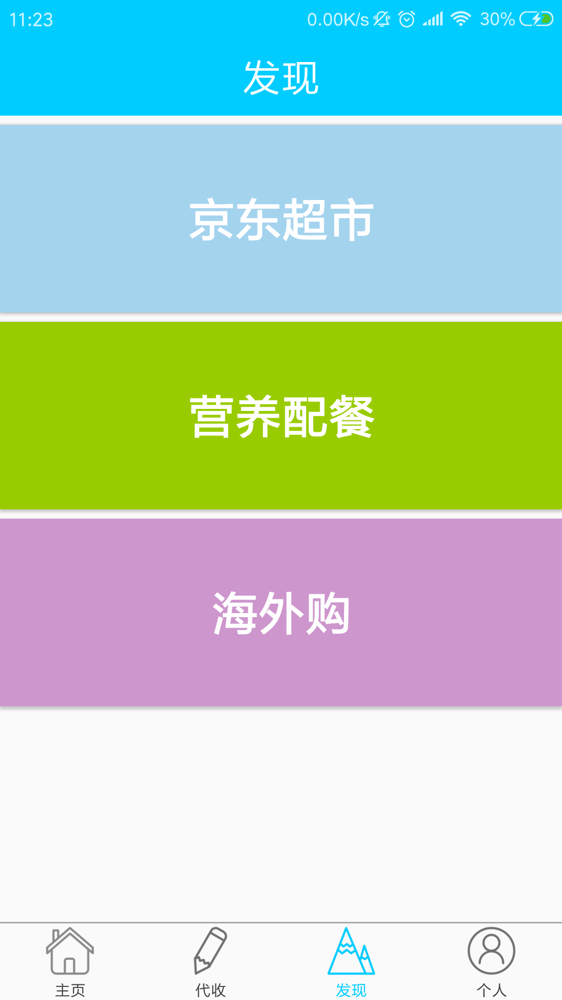

# express-agent-android

  # "i 代收"是一款解决校园快递信息管理和取件难题的应用软件。创新快递分发流程、实现快递信息精准推送、人人众包送货上门。

   ## App 主界面分为"主页","代收","发现","个人"
   
   ## 主页
   
   ### 在主页中我们可以发现和浏览可以代收的快递
   

      </img>
   

   ## 代收

   ### 在代收中可以发布我们的代收
   
   

      </img>
   

 
   ## 发现 
 
   ### 发现中可以浏览京东超市,营养配餐,海外购

   

      </img>
   

   ## 个人

   ###  在个人中可以查看自己帮别人代收的快递和发布的代收快递情况
   

      </img>
   

